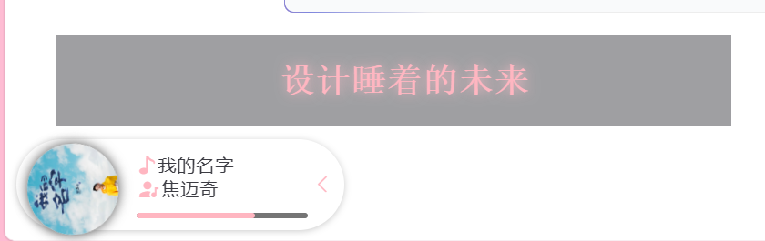
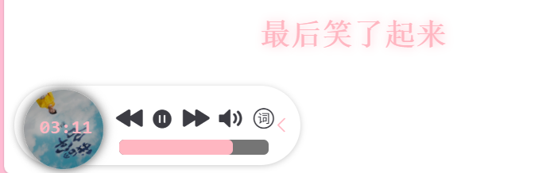
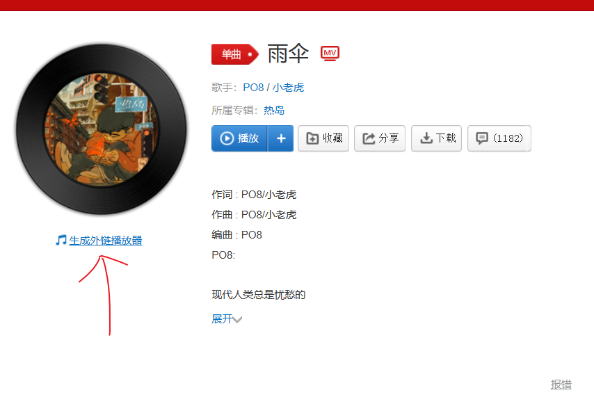
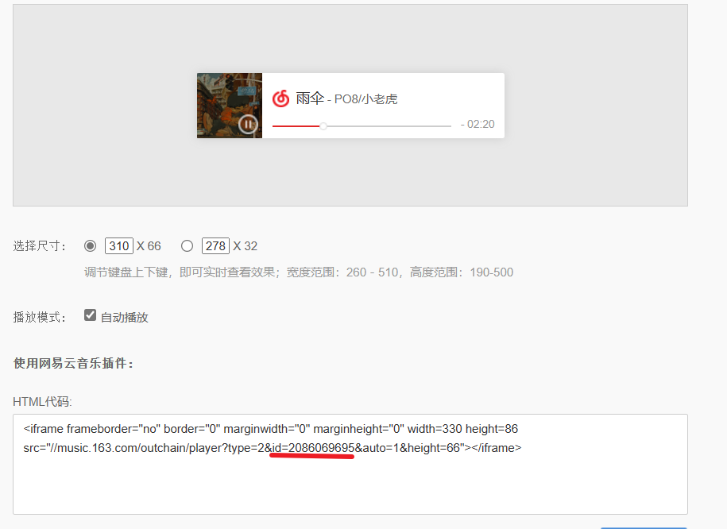
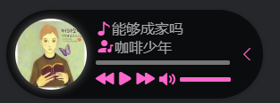

# vuepress-plugin-bgm-player2x





## 更新日志

- ***2023/12/05***
  
  - 修复了更改进度条时歌词的不匹配

- ***2023/12/07***
  
  - 增加音乐的淡入淡出效果，切换更自然

## 快速开始

```
npm i vuepress-plugin-bgm-player2x
```

**在config.js中配置**

```js
//导出一个bgmPlayer的对象
import { bgmPlayer } from 'vuepress-plugin-bgm-player2x'
//或者我们提供默认导出
import bgmPlayer from 'vuepress-plugin-bgm-player2x'
//在plugin下注册它
```


## 细节

> 基于@vuepress-reco/vuepress-plugin-bgm-player对reco2.x的适配版本。
> 
> 主题色基于reco主题进行适配。其他主题使用可能会报错，需要修改样式文件。
> 
> 可移动的歌词轮播(目前只支持网易云id导入)
> 
> 移动端初步适配
> 
> 原仓库地址：[vuepress-reco/vuepress-plugin-bgm-player: Bgm player plugin for vuepress-theme-reco or other vuepress theme (github.com)](https://github.com/vuepress-reco/vuepress-plugin-bgm-player)
> Vuepress 音乐播放器插件

| 使用位置           | 值                            |
| -------------- | ---------------------------- |
| plugin name    | vuepress-plugin-bgm-player2x |
| component name | BgMusic（自动出现在页面中，无需添加额外代码）   |

## Options

> 以下为插件注入时的参数。

### Attributes

| 参数            | 说明            | 类型      | 默认值                                                  | 可选值            |
| ------------- | ------------- | ------- | ---------------------------------------------------- | -------------- |
| rootComponent | (新增)是否注册为区根组件 | Boolean | true                                                 | true/false     |
| audios        | 播放列表          | Array   | 无                                                    | -              |
| position      | 播放器位置         | Object  | { left: '10px', bottom: '10px', 'z-index': '999999'} | -              |
| autoplay      | 是否自动播放        | Boolean | false                                                | true/false     |
| autoShrink    | 是否自动缩小        | Boolean | false                                                | true/false     |
| shrinkMode    | 指定PC端缩小为哪种模式  | String  | 'float'                                              | 'mini'/'float' |
| floatPosition | 指定浮窗模式浮动在哪一侧  | String  | 'left'                                               | 'left'/'right' |
| floatStyle    | 浮窗的样式         | Object  | { bottom: '200px', 'z-index': '999999' }             | -              |

### 

### rootComponent说明


我们默认为你将播放器放在全局根节点下，类似全局组件。（这是符合通常情况下你希望播放器所在位置的）除此之外我们还帮你将播放器注册名为"BgMusic"的全局组件，你可以在任何地方使用它。这些配置可以在

目录下的文件中查看

`projectHome > node_modules > vuepress-plugin-bgm-player2x>bin>enhanceAppFile.js`

### audios示例

- audios为播放列表的对象数组

- 无默认值必须配置

- audio可以是一个包含本地歌曲信息的对象，或网易云歌曲的id(String)（歌曲信息会自动根据网易云id联网获取）

- 示例
  
  ```js
  audios: [
    // 本地文件示例
    {
      name: '장가갈 수 있을까',
      artist: '咖啡少年',
      url: '/bgm/1.mp3',
      cover: '/bgm/1.jpg'
    },
    // 网络文件示例
    {
      name: '강남역 4번 출구',
      artist: 'Plastic / Fallin` Dild',
      url: 'https://assets.smallsunnyfox.com/music/2.mp3',
      cover: 'https://assets.smallsunnyfox.com/music/2.jpg'
    },
    {
      name: '用胳膊当枕头',
      artist: '최낙타',
      url: 'https://assets.smallsunnyfox.com/music/3.mp3',
      cover: 'https://assets.smallsunnyfox.com/music/3.jpg'
    }
    //网易云id实例
    {
      audioID: '517567145'
    }
  ]  
  ```
  
  ### shrinkMode说明

- PC端可以通过shrinkMode来指定正常模式缩小时缩小为哪种模式

- 移动端默认缩小为浮窗模式

### 网易云id说明

可以通过网页版获取歌曲外链的方式获得相关歌曲的id





### 滚动歌词说明

- 可拖拽移动

- 可隐藏开启

- 移动端隐藏

## About

- **兼容性**：vuepress-plugin-bgm-player是使用HTML5的Audio开发，故兼容性与Audio的兼容性相关
- 对于 `vuepress-theme-reco` 的 `dark` 模式的适配  
  
